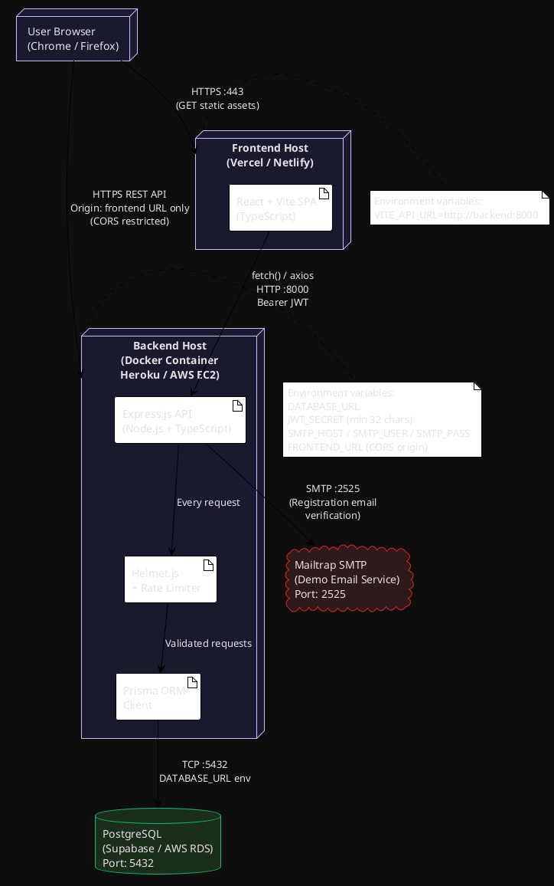
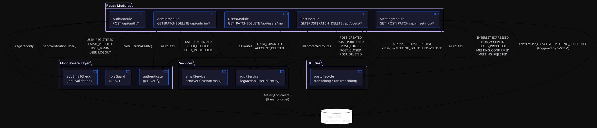
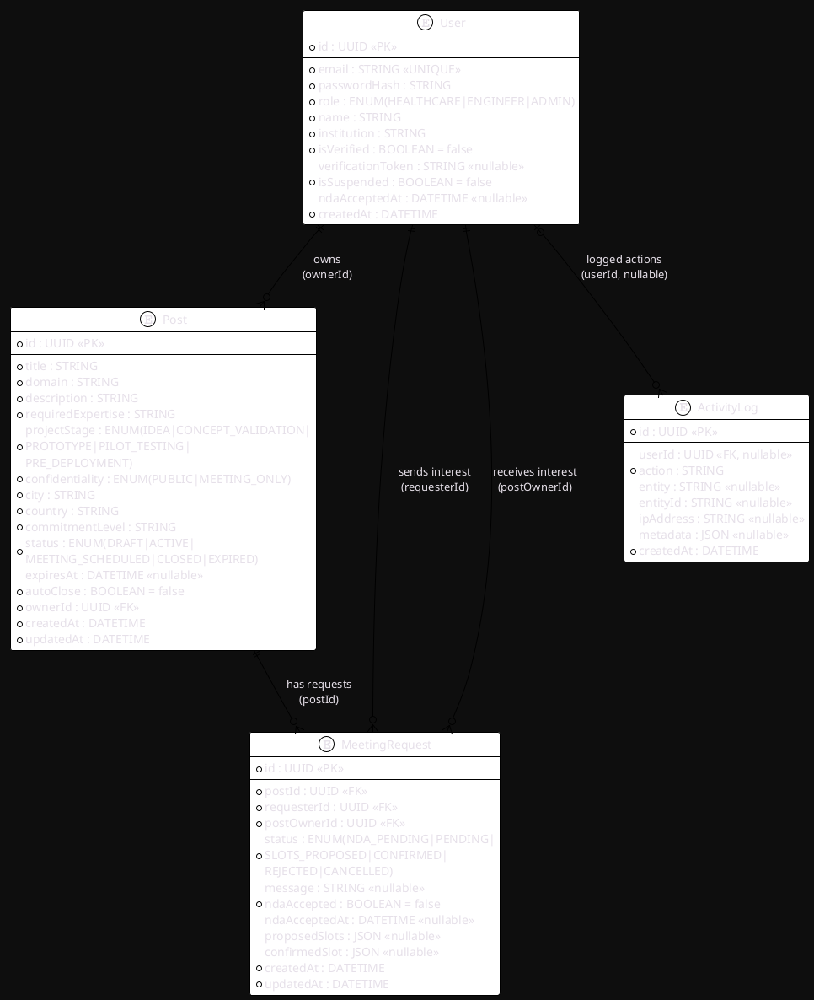
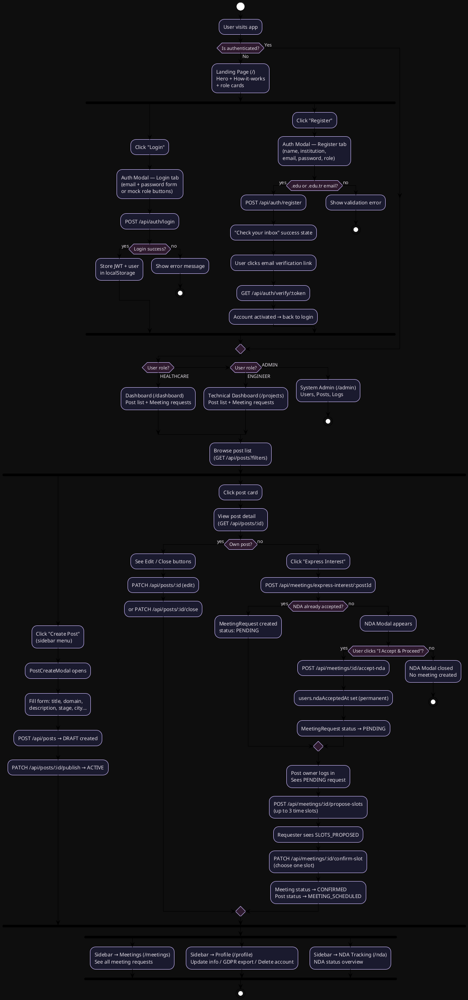
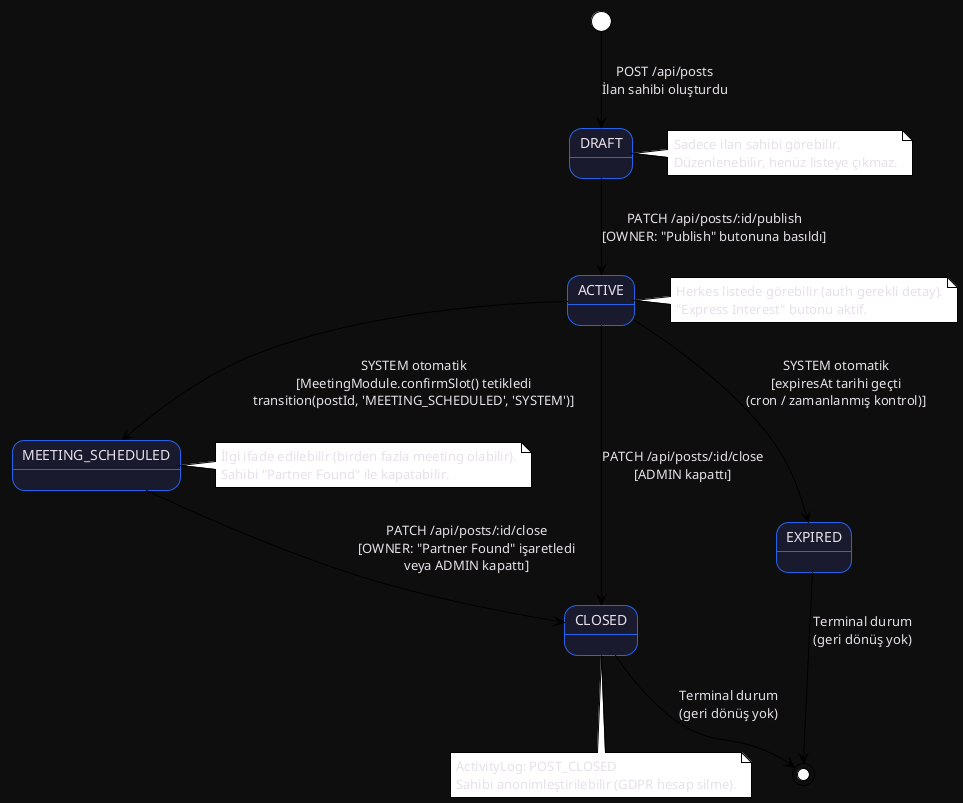
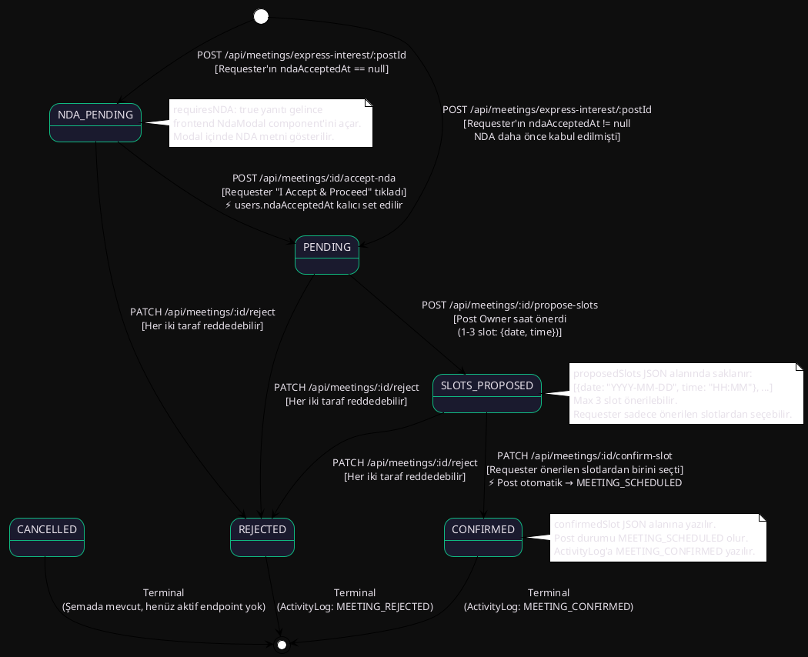

# HEALTH AI — Diyagram Dokümantasyonu

Bu dosya SDD (Software Design Document) için gereken 6 temel diyagramın tam içeriğini,
akış mantığını ve PlantUML kaynak kodlarını içermektedir.

---

## Diyagram 1 — Deployment Diagram (Bölüm 2.3)

### Açıklama

Sistemin fiziksel/çevresel dağılımını gösterir. HEALTH AI üç katmandan oluşur:

| Katman | Teknoloji | Port / Protokol |
|---|---|---|
| Frontend (Client) | React + Vite (Vercel/Netlify) | HTTPS :443 |
| Backend API | Node.js + Express (Docker / Heroku) | HTTP :8000 |
| Database | PostgreSQL (Supabase / AWS RDS) | TCP :5432 |
| Email Service | Mailtrap SMTP (Demo) | TCP :2525 |

**Bağlantı akışı:**
1. Kullanıcının tarayıcısı → Frontend statik dosyaları HTTPS üzerinden alır.
2. Frontend → Backend REST API çağrıları yapar (`VITE_API_URL=http://localhost:8000`). CORS sadece frontend origin'ine izin verir.
3. Backend → PostgreSQL veritabanına `DATABASE_URL` environment variable üzerinden bağlanır. Tüm sorgular Prisma ORM ile yapılır; SQL injection olmaz.
4. Backend → Kayıt akışında Mailtrap SMTP'ye e-posta gönderir (`sendVerificationEmail`).
5. Backend Helmet.js ile HTTP başlıklarını güvence altına alır; rate limiting `/api/auth/*` endpoint'lerine uygulanır (10 req/15 dk).

### PlantUML Kodu

---

## Diyagram 2 — Component / Interaction Diagram (Bölüm 3.2)

### Açıklama

Backend içindeki modüllerin (route → middleware → controller → service → DB) birbirleriyle
nasıl etkileştiğini gösterir.

**Modüller ve sorumlulukları:**

| Modül | Dosyalar | Görev |
|---|---|---|
| AuthModule | `routes/auth.ts` + `controllers/authController.ts` | Kayıt, login, email doğrulama, logout |
| PostModule | `routes/posts.ts` + `controllers/postsController.ts` | İlan CRUD, publish, close, delete |
| MeetingModule | `routes/meetings.ts` + `controllers/meetingsController.ts` | İlgi, NDA, slot önerme/onaylama, red |
| AdminModule | `routes/admin.ts` + `controllers/adminController.ts` | Kullanıcı/post yönetimi, log görüntüleme + CSV export |
| UsersModule | `routes/users.ts` + `controllers/usersController.ts` | Profil görüntüleme/güncelleme, GDPR (export/delete) |

**Middleware katmanı:**

| Middleware | Dosya | Ne zaman devreye girer |
|---|---|---|
| `authenticate` | `middleware/auth.ts` | Korumalı tüm endpoint'lerde — Bearer JWT doğrular |
| `roleGuard(...roles)` | `middleware/roleGuard.ts` | Rol kısıtlı endpoint'lerde (ör. Admin-only) |
| `eduEmailCheck` | `middleware/eduEmail.ts` | `POST /api/auth/register` — `.edu` veya `.edu.tr` zorunlu |

**Servisler:**

| Servis | Dosya | Kim kullanır |
|---|---|---|
| `auditService.log()` | `services/auditService.ts` | AuthModule, PostModule, MeetingModule, AdminModule, UsersModule — her işlem sonunda çağrılır |
| `sendVerificationEmail()` | `services/emailService.ts` | Sadece AuthModule (register akışı) |

**Yardımcı:**

| Util | Dosya | Kim kullanır |
|---|---|---|
| `transition(postId, to, triggeredBy)` + `canTransition()` | `utils/postLifecycle.ts` | PostModule (publish, close), MeetingModule (slot confirm → MEETING_SCHEDULED) |

**Kritik etkileşimler:**
- `MeetingModule.confirmSlot()` → `postLifecycle.transition(postId, 'MEETING_SCHEDULED', 'SYSTEM')` çağırır — Post durumunu otomatik günceller.
- `AdminModule` tüm veriye erişebilir ama `roleGuard('ADMIN')` ile korunur.
- `auditService.log()` fire-and-forget'tir: başarısız olsa bile API response crash olmaz.

### PlantUML Kodu

---

## Diyagram 3 — ER Diagram (Bölüm 4.1)

### Açıklama

`backend/prisma/schema.prisma` dosyasından türetilen tam veri modeli.

**Tablolar ve alanlar:**

**User**
- `id` UUID PK
- `email` STRING UNIQUE — sadece `.edu` / `.edu.tr`
- `passwordHash` STRING — bcrypt rounds:12
- `role` ENUM(HEALTHCARE, ENGINEER, ADMIN)
- `name` STRING
- `institution` STRING
- `isVerified` BOOLEAN default false
- `verificationToken` STRING nullable — email doğrulama token'ı
- `isSuspended` BOOLEAN default false
- `ndaAcceptedAt` DATETIME nullable — bir kez set edilir, kalıcıdır
- `createdAt` DATETIME

**Post**
- `id` UUID PK
- `title` STRING
- `domain` STRING — tıbbi/mühendislik alanı
- `description` STRING — MEETING_ONLY ise 120 karakter kısaltılır
- `requiredExpertise` STRING
- `projectStage` ENUM(IDEA, CONCEPT_VALIDATION, PROTOTYPE, PILOT_TESTING, PRE_DEPLOYMENT)
- `confidentiality` ENUM(PUBLIC, MEETING_ONLY)
- `city` STRING
- `country` STRING
- `commitmentLevel` STRING
- `status` ENUM(DRAFT, ACTIVE, MEETING_SCHEDULED, CLOSED, EXPIRED) default DRAFT
- `expiresAt` DATETIME nullable
- `autoClose` BOOLEAN default false
- `ownerId` UUID FK→User
- `createdAt` DATETIME
- `updatedAt` DATETIME

**MeetingRequest**
- `id` UUID PK
- `postId` UUID FK→Post
- `requesterId` UUID FK→User (relation: "Requester")
- `postOwnerId` UUID FK→User (relation: "PostOwner")
- `status` ENUM(NDA_PENDING, PENDING, SLOTS_PROPOSED, CONFIRMED, REJECTED, CANCELLED) default PENDING
- `message` STRING nullable — ilk mesaj
- `ndaAccepted` BOOLEAN default false
- `ndaAcceptedAt` DATETIME nullable
- `proposedSlots` JSON nullable — `[{date: "YYYY-MM-DD", time: "HH:MM"}]` array, max 3
- `confirmedSlot` JSON nullable — `{date, time}`
- `createdAt` DATETIME
- `updatedAt` DATETIME

**ActivityLog**
- `id` UUID PK
- `userId` UUID FK→User nullable (sistem aksiyonları için null olabilir)
- `action` STRING — ör: "USER_LOGIN", "NDA_ACCEPTED"
- `entity` STRING nullable — ör: "Post", "MeetingRequest"
- `entityId` STRING nullable
- `ipAddress` STRING nullable
- `metadata` JSON nullable
- `createdAt` DATETIME

**İlişkiler:**
- `User` 1 ←→ N `Post` (ownerId) — bir kullanıcı birden fazla ilan açabilir
- `User` 1 ←→ N `MeetingRequest` (requesterId) — bir kullanıcı birden fazla ilgi ifade edebilir
- `User` 1 ←→ N `MeetingRequest` (postOwnerId) — bir kullanıcı birden fazla isteği alabilir
- `Post` 1 ←→ N `MeetingRequest` (postId) — bir ilana birden fazla talep gelebilir
- `User` 0..1 ←→ N `ActivityLog` (userId) — nullable: sistem aksiyonları user'sız loglanabilir

### PlantUML Kodu

---

## Diyagram 4 — Navigation Flow Diagram (Bölüm 6.1)

### Açıklama

`frontend/src/App.tsx` route yapısı ve `Layout.tsx` navigation mantığından türetilmiştir.

**Route korumaları (`ProtectedRoute` component'i):**
- `user === null` → `/` (Landing) sayfasına yönlendir
- `user.role !== requiredRole` → `/unauthorized` (403 ekranı) göster

**Rol bazlı yönlendirmeler (login sonrası):**
- `HEALTHCARE` → `/dashboard`
- `ENGINEER` → `/projects`
- `ADMIN` → `/admin`

**Sidebar menü (rol bazlı):**
- ADMIN: Security Audit, Announcements, Meetings, NDA Tracking, Profile
- HEALTHCARE/ENGINEER: Create Post, My Posts, Announcements, Meetings, NDA Tracking, Profile

**Ekranlar ve erişim:**

| Yol | Ekran | Erişim |
|---|---|---|
| `/` | Landing | Herkese açık |
| `/unauthorized` | 403 ekranı | Herkese açık |
| `/dashboard` | Healthcare Dashboard (post listesi + meetings) | Sadece HEALTHCARE |
| `/projects` | Technical Dashboard (post listesi + meetings) | Sadece ENGINEER |
| `/admin` | System Admin Paneli | Sadece ADMIN |
| `/profile` | Profil sayfası | Tüm auth kullanıcılar |
| `/announcements` | Duyurular (Dashboard render eder) | Tüm auth kullanıcılar |
| `/meetings` | Toplantılar (Dashboard render eder) | Tüm auth kullanıcılar |
| `/nda` | NDA Takibi (TechnicalDashboard render eder) | Tüm auth kullanıcılar |
| `/collaborators` | Coming soon (Dashboard) | Tüm auth kullanıcılar |
| `/network` | Coming soon (TechnicalDashboard) | Tüm auth kullanıcılar |

**NDA Modal tetikleme akışı:**
Post listesinde "Express Interest" tıklandığında:
1. Backend `POST /api/meetings/express-interest/:postId` çağrılır
2. Yanıtta `requiresNDA: true` gelirse → `NdaModal` açılır
3. Kullanıcı "I Accept & Proceed" → `POST /api/meetings/:id/accept-nda`
4. Backend `users.ndaAcceptedAt` set eder + `MeetingRequest.status = PENDING`
5. Gelecekteki "Express Interest" tıklamalarında NDA modal tekrar çıkmaz

### PlantUML Kodu

---

## Diyagram 5 — Post Lifecycle State Diagram (Bölüm 8.1)

### Açıklama

`backend/src/utils/postLifecycle.ts` dosyasındaki `ALLOWED` geçiş tablosundan türetilmiştir.

**Durumlar ve terminalleri:**

| Durum | Terminal mi? | Anlamı |
|---|---|---|
| DRAFT | Hayır | İlan oluşturuldu, henüz yayında değil |
| ACTIVE | Hayır | İlan yayında, ilgi ifade edilebilir |
| MEETING_SCHEDULED | Hayır | En az bir toplantı onaylandı |
| CLOSED | **Evet** | Partner bulundu veya admin kapattı — geri dönüş yok |
| EXPIRED | **Evet** | `expiresAt` tarihi geçti, sistem otomatik kapattı — geri dönüş yok |

**Geçiş tablosu (`postLifecycle.ts` ALLOWED sabiti):**

| Başlangıç | Hedef | Tetikleyici | Kim | Endpoint / Mekanizma |
|---|---|---|---|---|
| — | DRAFT | Post oluşturuldu | İlan sahibi | `POST /api/posts` |
| DRAFT | ACTIVE | "Publish" tıklandı | OWNER (İlan sahibi) | `PATCH /api/posts/:id/publish` |
| ACTIVE | MEETING_SCHEDULED | Toplantı onaylandı | SYSTEM (otomatik) | `PATCH /api/meetings/:id/confirm-slot` içinden |
| ACTIVE | EXPIRED | `expiresAt` geçti | SYSTEM (cron/zamanlanmış) | Scheduled check |
| ACTIVE | CLOSED | Admin kapattı | ADMIN | `PATCH /api/posts/:id/close` |
| MEETING_SCHEDULED | CLOSED | "Partner Found" tıklandı | OWNER veya ADMIN | `PATCH /api/posts/:id/close` |

**Kural:** CLOSED ve EXPIRED'dan hiçbir duruma geçiş yoktur.

### PlantUML Kodu

---

## Diyagram 6 — Meeting Request Lifecycle State Diagram (Bölüm 8.2)

### Açıklama

`backend/src/controllers/meetingsController.ts` dosyasındaki iş mantığından türetilmiştir.

**Durumlar:**

| Durum | Anlamı |
|---|---|
| NDA_PENDING | Kullanıcı henüz NDA kabul etmedi — `ndaAcceptedAt` null |
| PENDING | NDA kabul edildi, post sahibi saat önerisi bekliyor |
| SLOTS_PROPOSED | Post sahibi 1-3 saat önerdi, karşı taraf seçim bekliyor |
| CONFIRMED | Saat onaylandı, toplantı kesinleşti — terminal |
| REJECTED | İki taraftan biri reddetti — terminal |
| CANCELLED | Şemada mevcut, şu an backend'de aktif endpoint yok — ileride kullanım için ayrılmış — terminal |

**Geçiş tablosu:**

| Başlangıç | Hedef | Tetikleyici | Kim | Endpoint |
|---|---|---|---|---|
| — | NDA_PENDING | Express Interest, NDA henüz kabul edilmedi | Requester | `POST /api/meetings/express-interest/:postId` |
| — | PENDING | Express Interest, NDA daha önce kabul edildi | Requester | `POST /api/meetings/express-interest/:postId` |
| NDA_PENDING | PENDING | "I Accept & Proceed" tıklandı | Requester | `POST /api/meetings/:id/accept-nda` |
| NDA_PENDING | REJECTED | Reddet tıklandı | Her iki taraf | `PATCH /api/meetings/:id/reject` |
| PENDING | SLOTS_PROPOSED | Post sahibi saat önerdi (1-3 slot) | Post Owner | `POST /api/meetings/:id/propose-slots` |
| PENDING | REJECTED | Reddet tıklandı | Her iki taraf | `PATCH /api/meetings/:id/reject` |
| SLOTS_PROPOSED | CONFIRMED | Requester bir slotu seçti | Requester | `PATCH /api/meetings/:id/confirm-slot` |
| SLOTS_PROPOSED | REJECTED | Reddet tıklandı | Her iki taraf | `PATCH /api/meetings/:id/reject` |

**Önemli yan etkiler:**
- `NDA_PENDING → PENDING` geçişi: `users.ndaAcceptedAt` kalıcı olarak set edilir.
  Bir sonraki "Express Interest"te NDA modal tekrar çıkmaz.
- `SLOTS_PROPOSED → CONFIRMED` geçişi: `postLifecycle.transition(postId, 'MEETING_SCHEDULED', 'SYSTEM')` otomatik çağrılır.
  Eğer post zaten MEETING_SCHEDULED'daysa hata fırlatmaz (catch ile yutulur).
- `reject` endpoint'i terminal durumlardan (CONFIRMED, REJECTED, CANCELLED) çağrılamaz.

### PlantUML Kodu

---

## PlantUML Nasıl Render Edilir?

1. **Online:** [plantuml.com/plantuml/uml](https://www.plantuml.com/plantuml/uml) adresine kod yapıştır
2. **VS Code:** "PlantUML" extension (jebbs.plantuml) — Ctrl+Shift+P → "PlantUML: Preview Current Diagram"
3. **IntelliJ / WebStorm:** PlantUML Integration plugin — editor'de preview
4. **CLI:** `java -jar plantuml.jar diagrams.puml` komutuyla PNG/SVG üret

Her diyagram ayrı `.puml` dosyasına alınıp CI'da otomatik render edilebilir.

---

*Oluşturulma tarihi: 2026-04-29*
*Kaynak: HEALTH AI proje kodu — frontend/src/, backend/src/, backend/prisma/schema.prisma*
